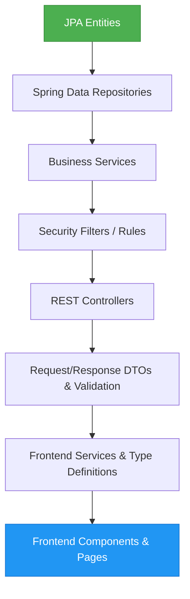

# AGENT.md: Master Entrypoint for Coding Agents

Welcome, Coding Agent. This document serves as your primary guide for understanding, extending, and implementing features in the **ClassManager** system. Treat this file as your operational directive.

---

## 1. Project Purpose
ClassManager is a multi-tenant, multi-school online homeroom class management platform. It allows homeroom teachers to track class competition points (điểm thi đua), maintain student profiles, handle student-group assignments, and automatically or manually lock weekly results. The system is designed to be highly secure, auditable, and transparent, with distinct user roles and a clear distinction between administrative roles and organizational positions (e.g., Group Leaders).

---

## 2. Architectural Overview
ClassManager is built as a decoupled web application:
- **Backend**: Spring Boot 3.x following Clean Architecture / Domain-Driven Design principles. It uses PostgreSQL as the database and JPA for ORM. The business logic is isolated within the Service layer, while controllers handle REST API traffic using Resource-based (role-free) URLs.
- **Frontend**: React 19 + TypeScript + Vite + TailwindCSS. It implements a strictly typed data model (no `any`), page routing with role-based Route Guards, TanStack Table for data listing, Recharts for visual tracking, and React Hook Form for dynamic profiles.
- **Security**: JWT-based stateless authentication with HttpOnly Refresh Token cookies and OTP-based phone verification (BCrypt-hashed).

---

## 3. Source-of-Truth Priority
When resolving contradictions or determining implementation requirements, follow this strict priority hierarchy:

```text
Priority 1: SRS.md (docs/SRS.md)
Priority 2: Business Rules (docs/02-domain/business-rules.md)
Priority 3: Domain Model (docs/02-domain/domain-model.md)
Priority 4: API Specifications (docs/04-api/)
Priority 5: Architecture Docs (docs/05-architecture/)
```

*Note: The original Vietnamese SRS (`docs/SRS.md`) is the absolute source of truth.*

---

## 4. Coding Constraints
You must strictly adhere to the following constraints during code generation and modification:
1. **Never Violate Business Rules**: All `BR-*` rules in `docs/02-domain/business-rules.md` are non-negotiable.
2. **Entity Consistency**: Do not introduce database tables or JPA entities outside the defined domain model in `docs/02-domain/domain-model.md` and `docs/03-data/database-schema.md`.
3. **Layer Separation**: Do not move business logic or database operations into Controllers. Controllers must only handle request validation, service delegation, and HTTP response formatting.
4. **Immutable Point Logs**: The `point_logs` table and its corresponding entity `PointLog` are strictly immutable. Do not write or generate any `UPDATE` or `DELETE` queries/methods for this resource. Points are corrected solely by inserting opposing point logs.
5. **Respect Approval Workflows**: Users start in a `PENDING` state and must be approved before accessing secured endpoints (Teachers approved by ADMIN, Students approved by their Class TEACHER).
6. **Respect Permission Matrix**: Enforce the permission matrix defined in `docs/02-domain/permissions.md` at both the Service layer (via `@PreAuthorize` or manual checks) and the UI layer (via Route Guards).

---

## 5. Implementation Priorities
When implementing new features, modules, or refactoring code, follow this sequential flow:



1. **Entities**: Define/update JPA entities with correct relations, constraints, and audit fields.
2. **Repositories**: Write custom repository queries (prevent N+1 queries using `@EntityGraph` or join fetches).
3. **Services**: Implement core business logic, validation rules, custom exception throwing, and transactional scopes.
4. **Security**: Configure endpoint protection, custom method security permissions, and token parsing.
5. **Controllers**: Declare REST endpoints, map request/response payloads, and specify HTTP statuses.
6. **DTOs**: Code strict request/response data transfer objects containing Bean Validation constraints.
7. **Frontend Services & Types**: Map TS types and implement Axios-based service handlers.
8. **Frontend Components & Pages**: Build/extend pages, charts, tables, dynamic forms, and error states.
